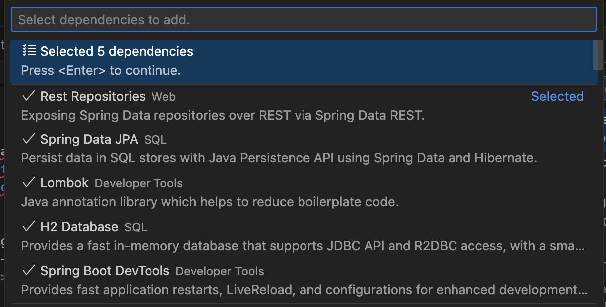
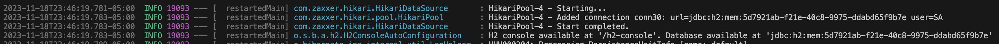

# Spring Boot 3 - Api Rest full - Swagger

Create Spring boot 3 project, with maven, using dependencies:

- **Rest Repositories** Web
- **Spring Data JPA** SQL
- **H2 Database** SQL
- **Lombok** Developer Tools
- **Spring Boot DevTools** Developer Tools



## OpenAPIDefinition

### Spring Data Rest support

springdoc-openapi project supports spring-boot-starter-data-rest types like: @RepositoryRestResource and QuerydslPredicate annotations.

The projects that use spring-boot-starter-data-rest should use:

springdoc-openapi-starter-webmvc-api if they need only the access to the OpenAPI endpoints

OR springdoc-openapi-starter-webmvc-ui, if they need also the access to the swagger-ui

Add dependency maven, by spring boot 3, use https://springdoc.org/

```xml
		<dependency>
			<groupId>org.springdoc</groupId>
			<artifactId>springdoc-openapi-starter-webmvc-ui</artifactId>
			<version>2.1.0</version>
		</dependency>
```
view in http://localhost:8080/swagger-ui/index.html

In main class, use **OpenAPIDefinition** annotation

```java
@SpringBootApplication
@OpenAPIDefinition(info = @Info(title = "Product API Rest full", version = "1.0.0"))

public class DemoApiRestFullApplication {
```

In RestController, use **Tag** annotation

```java
@Tag(name = "Product", description = "Product End Point")
```

## H2 database

View h2 database in http://localhost:8080/h2-console get JDBC-URL from logger output, example:



